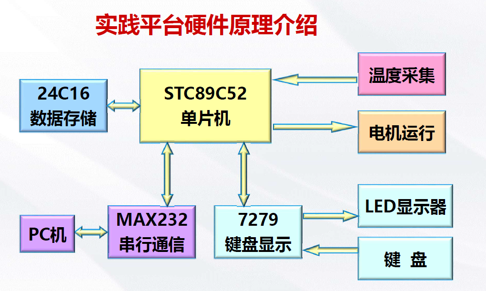
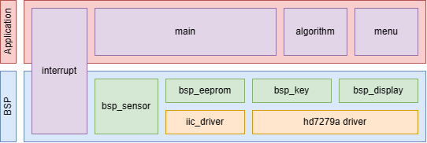
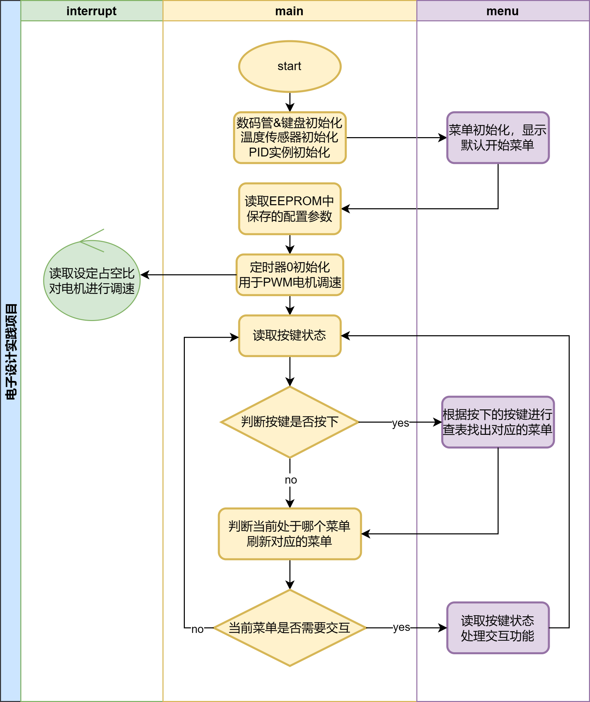

# 简介

**本项目为华东理工信息工程电子系统设计实践的课程设计，包含以下内容**

**已实现所有所需功能**

- [x] **温度显示**
- [x] **电机速度测试**
- [x] **电机调速**
- [x] **参数设置--(断电参数保存)**
- [x] **PID调节温度---（参数需自行调节）**

# 软件架构图

# 流程图

# note
> 代码使用GBK编码，使用VSCode打开,使用Embedded IDE插件配合Keil C51开发

